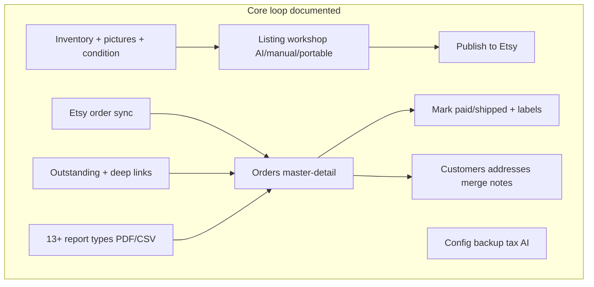

# Functional & UX documentation coverage audit

**Date:** 2026-05-24  
**Purpose:** Answer “Is anything missing?” before code fixes — especially for a **modern, graphical, easy-to-use** Etsy store manager. **Doc before code:** gaps here should become ADRs or `ui-design.md` updates, not guessed in implementation.

**Related artifacts:**

- Phase 1 doc gate: [no-developer-questions-build.md](no-developer-questions-build.md) §4
- Phase 2 code lag: [DOC_COMPLIANCE_AUDIT.md](DOC_COMPLIANCE_AUDIT.md)
- UX canon: [ui-design.md](ui-design.md), [frontend-architecture.md](frontend-architecture.md), [System_Colors.md](System_Colors.md), ADR-009–069

---

## Executive summary

| Question                                                                      | Answer                                                                                                                                                                                            |
| ----------------------------------------------------------------------------- | ------------------------------------------------------------------------------------------------------------------------------------------------------------------------------------------------- |
| Is the **core vintage/antique Etsy reseller** workflow documented end-to-end? | **Yes** — inventory → listing → Etsy publish → orders → ship → reports → outstanding → config/backup.                                                                                             |
| Is **every possible** Etsy store need covered?                                | **No** — and that is intentional for v1. Many Etsy-platform features (messages, refunds API, ads, reviews inbox) are **out of scope** or **not documented** (see §3).                             |
| Is a **modern graphical UI** fully specified?                                 | **Partially** — strong on colors, components, a11y, mobile, empty states, wizard; **gaps** in unified visual system, header chrome, dashboard composition, and several screen-level layouts (§4). |
| Safe to start code fixes now?                                                 | **Safe for compliance fixes** per [DOC_COMPLIANCE_AUDIT.md](DOC_COMPLIANCE_AUDIT.md). **Recommended:** close §5 “doc gaps” first if you want zero UI guesswork for priorities 9–52.               |

---

## 1. Product scope (what this app is)

**Documented identity:** Single-user **local** app for **Trudy’s Classic Treasures** — vintage/antique Etsy shop. Official Etsy API only; no carrier APIs; no scraping ([ADR-011](adr/0011-compliance-with-etsy-rules.md), [etsy-compliance.md](etsy-compliance.md)).

**Well-covered operational domains (85 ADRs + ui-design):**

---

## 2. Functional coverage matrix

Legend: **Spec** = documented in ADR/ui-design | **Deferred** = explicitly post-v1/future | **Gap** = not documented — needs ADR or ui-design section

### 2.1 Orders & sales

| Capability                       | Spec    | Notes                                                        |
| -------------------------------- | ------- | ------------------------------------------------------------ |
| Etsy OAuth + shop selector       | Yes     | ADR-007, 016, 034                                            |
| Sync receipts → local orders     | Yes     | ADR-019                                                      |
| Manual orders + line items       | Yes     | ADR-003, 015, 031                                            |
| Mark paid / mark shipped         | Yes     | ADR-021, 031 — **code wrong today** (audit)                  |
| Void / cancel (no delete)        | Yes     | ADR-022, design-decisions §4                                 |
| Ship-to snapshot                 | Yes     | ADR-017                                                      |
| Tracking number                  | Yes     | ADR-031 — schema/API; migration pending                      |
| Shipping labels (local print)    | Yes     | shipping-label-carrier-templates, ui-design                  |
| Thank-you + invoice (per order)  | Yes     | ADR-036, 013 — path routes spec’d                            |
| Link customer to order           | Yes     | ADR-031 §15 — API spec’d                                     |
| Partial shipments / split orders | Gap     | Multi-item orders yes; split shipment workflow not specified |
| Refunds / returns processing     | Gap     | Tutorial mentions Etsy policies; **no app workflow**         |
| Etsy buyer messages / convos     | Gap     | Not in scope (Etsy shop UI)                                  |
| Cases / disputes                 | Gap     | Not documented                                               |
| Gift message on receipt          | Gap     | Not specified in sync UI                                     |
| Multi-shop management            | Partial | One active shop per session; no multi-shop dashboard         |

### 2.2 Inventory & listing

| Capability                          | Spec     | Notes                                                                       |
| ----------------------------------- | -------- | --------------------------------------------------------------------------- |
| Item lifecycle statuses             | Yes      | ADR-002, 017                                                                |
| 10 pictures + 5 condition pictures  | Yes      | ADR-010, 026, 033                                                           |
| Listing workshop (3 modes)          | Yes      | ADR-023, 030                                                                |
| Publish / approve gate              | Yes      | ADR-023, 021                                                                |
| Other costs (cleaning, repair)      | Yes      | ADR-038, 017                                                                |
| Vendor `purchases` table (sourcing) | API only | **Gap: no UI** for vendor purchase rows (only `purchase_cost` on inventory) |
| CSV import                          | Yes      | ADR-047                                                                     |
| Duplicate warnings                  | Yes      | ADR-048                                                                     |
| Listing quality score               | Yes      | ADR-068                                                                     |
| Profit/margin on item               | Yes      | ADR-038                                                                     |
| Barcode / SKU scanning              | Gap      | Not documented                                                              |
| Warehouse bins / locations          | Gap      | Not documented                                                              |
| Variations (size/color SKUs)        | Partial  | `quantity` on inventory; no Etsy variation editor spec                      |
| Export inventory to CSV             | Deferred | ADR-047 Notes only                                                          |

### 2.3 Customers

| Capability                       | Spec | Notes                             |
| -------------------------------- | ---- | --------------------------------- |
| Flat address + ship-to addresses | Yes  | ADR-003, 017                      |
| Order history timeline           | Yes  | ADR-052                           |
| Interaction notes log            | Yes  | ADR-065 — table pending migration |
| Merge / dedup tool               | Yes  | ADR-053                           |
| Repeat customer badge            | Yes  | ADR-066                           |
| Inactivate customer              | Yes  | design-decisions §5               |
| Email campaigns                  | Gap  | Out of scope                      |

### 2.4 Reports & money

| Capability                             | Spec     | Notes                              |
| -------------------------------------- | -------- | ---------------------------------- |
| 9 legacy reports + 4 extension reports | Yes      | ADR-006, 013, 038, 039, 054, 056   |
| Date range + PDF/CSV                   | Yes      | ADR-036                            |
| Tax summary                            | Yes      | ADR-039 — per-state rates deferred |
| Accounting CSV export                  | Yes      | ADR-056                            |
| Multi-currency operations              | Deferred | USD-only v1 (ADR-008, 017)         |
| QuickBooks live sync                   | Gap      | Export only (056), no live API     |

### 2.5 Operations & platform

| Capability                 | Spec | Notes                          |
| -------------------------- | ---- | ------------------------------ |
| Backup / restore           | Yes  | ADR-027                        |
| Activity audit log         | Yes  | ADR-037 — table pending        |
| Scheduled Etsy sync        | Yes  | ADR-057 (client interval)      |
| SQLite hardening           | Yes  | ADR-058 — partial in code      |
| Sample demo data           | Yes  | ADR-069 + fixture              |
| First-run wizard           | Yes  | ADR-044                        |
| Global search              | Yes  | ADR-041                        |
| Notifications center       | Yes  | ADR-051                        |
| Print queue                | Yes  | ADR-055                        |
| Undo last N PATCHes        | Yes  | ADR-067                        |
| Offline retry queue        | Yes  | ADR-050 — no Service Worker v1 |
| Etsy ads / SEO / analytics | Gap  | Not this app’s scope           |

### 2.6 Outstanding & workflow

| Capability                   | Spec     | Notes                                       |
| ---------------------------- | -------- | ------------------------------------------- |
| Data-driven outstanding list | Yes      | ADR-020                                     |
| Full-page Outstanding tab    | Yes      | ADR-009 v1                                  |
| Side outstanding panel       | Deferred | ADR-009 post-v1                             |
| Side commands panel          | Deferred | ADR-009 post-v1                             |
| Outstanding types 3 & 7      | Deferred | ADR-020 (etsy_not_synced, validation_issue) |

---

## 3. Explicit non-goals (should stay out of v1 unless you add ADRs)

These are **common** in Etsy seller tools but **not** specified anywhere. Treat as **intentionally excluded** until you write a new ADR accepting scope creep:

- Etsy Conversations / buyer messaging inbox
- Refund and return **processing** (beyond void/cancel local order)
- Review response management
- Etsy Ads / offsite ads / SEO rank tracking
- Multi-marketplace (eBay, Amazon, Shopify)
- Live carrier rate shopping or label purchase (USPS/UPS APIs)
- Team/multi-user roles and permissions
- Cloud hosting / SaaS multi-tenant
- Native mobile apps (responsive web only per ADR-061)
- Light theme / theme switcher (only dark palette in System_Colors)

**Recommendation:** Add **ADR-070: Product scope and non-goals** (short) so implementers never infer these from silence.

---

## 4. Modern graphical UI — documentation status

### 4.1 What is already strong

| Area                                     | Where specified                                                    |
| ---------------------------------------- | ------------------------------------------------------------------ |
| Dark navy visual palette                 | [System_Colors.md](System_Colors.md), `globals.css`                |
| Intuitive UX principles                  | [ui-design.md](ui-design.md) § Intuitive design                    |
| Shared component library                 | ADR-028, [frontend-architecture.md](frontend-architecture.md) §3.2 |
| WCAG 2.1 AA                              | ADR-045                                                            |
| Mobile breakpoints                       | ADR-061                                                            |
| Empty states + CTAs                      | ADR-059                                                            |
| Field help tooltips                      | ADR-060                                                            |
| Toasts, modals, tables, badges           | frontend-architecture                                              |
| Keyboard shortcuts                       | ADR-049                                                            |
| Master-detail Sales, two-panel Inventory | ADR-031, 030 (layout diagrams)                                     |
| Report viewer 4 actions                  | ADR-013                                                            |

### 4.2 UX documentation gaps (fix before “polish” build)

| Gap                                                | Impact                                                                       | Suggested doc action                                                                                                                                                                 |
| -------------------------------------------------- | ---------------------------------------------------------------------------- | ------------------------------------------------------------------------------------------------------------------------------------------------------------------------------------ |
| **No single “visual design system”** beyond colors | Inconsistent spacing, type scale, radius, shadows                            | **ADR-071** or `ui-design-system.md`: typography (scale), spacing (4/8 grid), border radius, elevation, focus rings, motion (`prefers-reduced-motion` in ADR-045 but not in globals) |
| **AppHeader not fully specified**                  | Search, notifications, print queue, recent items scattered across ADRs       | **ui-design.md § Header** or **ADR-072**: wireframe + icon order + responsive collapse                                                                                               |
| **Dashboard composition**                          | ADR-016 base vs KPI/activity extensions (016 Notes, 064, 037) not one layout | **ADR-016 addendum** or ui-design § Dashboard: card grid, widget order, empty/connected states                                                                                       |
| **List filters UI**                                | ADR-029 server params; no chip/bar spec                                      | ui-design per tab: status filters, date presets, “clear filters”                                                                                                                     |
| **Shipping label preview**                         | Template data yes; modal/preview/print flow thin                             | ui-design § Sales: label preview modal dimensions, error states                                                                                                                      |
| **Settings page**                                    | ADR-034 card grid yes; current code ≠ spec                                   | Already ADR-034 — implement to spec                                                                                                                                                  |
| **ConfirmDialog vs Modal**                         | ADR-032 + frontend-architecture                                              | Component spec exists — ensure adoption list per tab                                                                                                                                 |
| **Loading skeletons**                              | LoadingSpinner only                                                          | ui-design: prefer skeleton rows in DataTable for perceived performance                                                                                                               |
| **Vendor purchases UI**                            | Schema + API, no screen                                                      | ADR or Inventory detail § “Sourcing”: link `purchases` rows to item                                                                                                                  |
| **Multi-line order editor**                        | order_items in schema                                                        | ADR-031: add line-item table UI (add/remove line, pick inventory)                                                                                                                    |

### 4.3 “Easy to understand” checklist (doc completeness)

| User question                  | Documented answer?                          |
| ------------------------------ | ------------------------------------------- |
| What do I do first?            | Yes — ADR-044 wizard                        |
| Where are orders I must ship?  | Yes — Outstanding + Sales filters           |
| How do I list an item on Etsy? | Yes — Inventory workshop + ADR-023          |
| How do I print a label?        | Yes — ui-design + shipping templates        |
| How do I see profit?           | Yes — ADR-038 + reports                     |
| What if Etsy disconnects?      | Yes — ADR-025, 050, header status           |
| What if I mess up data?        | Yes — ADR-027 backup, 067 undo (PATCH only) |
| How do I learn the app?        | Yes — Tutorial tab + ADR-060 tooltips       |

---

## 5. Recommended “doc before code” closure (optional Phase 1b)

If you want **maximum confidence** before UI implementation (priorities 9–52), add these **small** docs (estimate 1–2 doc PRs, no application code):

| Priority | Deliverable                                                             | Closes                                                                                                                                          |
| -------- | ----------------------------------------------------------------------- | ----------------------------------------------------------------------------------------------------------------------------------------------- |
| P0       | **ADR-070: Product scope and non-goals**                                | §3 ambiguity                                                                                                                                    |
| P1       | **ADR-071: Visual design system** (type, space, motion, density)        | §4.2 modern UI                                                                                                                                  |
| P1       | **ui-design.md § Global header** (search, bell, queue, recent, connect) | Header chrome                                                                                                                                   |
| P1       | **ui-design.md § Dashboard layout** (widget grid)                       | Home screen                                                                                                                                     |
| P2       | **ADR-031 addendum** or ui-design § Order line items editor             | Multi-item orders                                                                                                                               |
| P2       | **Inventory: vendor purchases UI** (section in ADR-030 or mini-ADR)     | Sourcing table                                                                                                                                  |
| P3       | **Shipping label preview UX** (section in ui-design § Sales)            | Label flow                                                                                                                                      |
| P3       | **ADR-009 Decision vs Implementation** harmonization                    | Side panel wording (Decision still describes v1 panels; Implementation defers — add one sentence in Decision pointing to Implementation status) |

After P0–P1, an implementer can build a **cohesive modern shell** without inventing layout. After P2–P3, day-to-day flows are fully specified.

---

## 6. Relationship to code audit

| Layer                                      | Status                                                                                     |
| ------------------------------------------ | ------------------------------------------------------------------------------------------ |
| **Documentation completeness** (this file) | Core reseller: **ready**; optional P1–P3 gaps above; platform features: **explicitly out** |
| **Documentation internal consistency**     | Phase 1 gate **complete**                                                                  |
| **Code vs documentation**                  | [DOC_COMPLIANCE_AUDIT.md](DOC_COMPLIANCE_AUDIT.md) — code **behind** spec                  |

**Order of work:**

1. **Optional:** Phase 1b doc gaps (§5) — if you want zero UI ambiguity
2. **Required for correctness:** Critical code fixes (mark-shipped, enums, migration 003)
3. **Build priorities 8–52** per [no-developer-questions-build.md](no-developer-questions-build.md) §5, using ADRs + ui-design + frontend-architecture as SSOT

---

## 7. Sign-off

| Gate                                                          | Status                                                                                                                       |
| ------------------------------------------------------------- | ---------------------------------------------------------------------------------------------------------------------------- |
| Core Etsy vintage store manager functions documented?         | **Yes**                                                                                                                      |
| Every store-owner need either specified or explicitly scoped? | **Yes** — ADR-070 (2026-05-24)                                                                                               |
| Modern easy UI fully specified?                               | **Yes** — ADR-071 + ui-design §1b–1d, §5.9–5.10 (2026-05-24)                                                                 |
| Ready for code (compliance + build)?                          | **Yes (2026-05-24)** — Phase 1b signed off; start [DOC_COMPLIANCE_AUDIT.md](DOC_COMPLIANCE_AUDIT.md) critical fixes, then §5 |

---

_Update this file when ADR-070+ or ui-design sections are added. Re-run after major scope changes._
