# Deep audit — documentation, code, tests, and gates

**Date:** 2026-05-24  
**Branch:** `feature/final-system-completion` (post Phase 1b sign-off)  
**Principle:** Docs are canonical; code must catch up. This audit is the **full-board** pass across schema, API, business rules, UI, tests, CI, scope (ADR-070), and meta-doc accuracy.

**Companion artifacts:**
- [DOC_COMPLIANCE_AUDIT.md](DOC_COMPLIANCE_AUDIT.md) — row-level spec vs code tables (Phase 2)
- [DOC_FUNCTIONAL_UX_COVERAGE_AUDIT.md](DOC_FUNCTIONAL_UX_COVERAGE_AUDIT.md) — store-owner capability coverage (Phase 1b)
- [no-developer-questions-build.md](no-developer-questions-build.md) §4–§7 — gates and §5 build order

---

## Executive summary

| Layer | Health | Headline |
|-------|--------|----------|
| **Documentation (ADRs + ui-design)** | **Strong** | Phase 1 + 1b complete; no invalid enums (`shipped`/`open`/`pending`) in ADR text; ADR-070/071 close scope and UI consistency |
| **Code vs docs** | **Weak** | ~37% of ADR-018 catalog routes missing; 3 **Critical** business/schema bugs; ADR-031 Sales UI largely unbuilt |
| **Tests** | **Minimal** | 4 Node test files; no automated enum/report/deep-link guards |
| **CI** | **Present** | Lint, type-check, migrate, seed, `npm test` — tests do not enforce compliance |
| **`.cursorrules` §12`** | **Overclaims** | “Priorities 1–7 complete” true for shell/backend slice; **not** true for v1 scope in ADR-070 |

**Verdict:** Safe to **start code** on Critical + schema batch. **Unsafe** to bulk-build UI (priorities 11+) before Critical batch and migration `003` — master-detail would rest on wrong enums and missing columns.

---

## 1. Documentation integrity (cross-board)

### 1.1 ADR ↔ ADR consistency

| Check | Result |
|-------|--------|
| `order_status = shipped` in `documents/adr/*.md` | **None** — canonical `active` \| `void` \| `cancelled` only |
| `open` / `pending` as order enums in ADRs | **None** in Decision bodies |
| Ship-until-paid + override on **orders** header | **Consistent** (ADR-021, 031, 017) |
| Fulfillment = `shipping_date` / badges, not `order_status` | **Consistent** (ADR-031, 071) |
| Three-table model (sales vs vendor `purchases`) | **Consistent** across ADR-003, 017, 019, `.cursorrules` §2 |

### 1.2 Hub docs vs ADRs

| Doc | Status |
|-----|--------|
| [ADR-018](adr/0018-api-surface-endpoints.md) + Appendix B | Extension surface documented; **~35 route groups not in code** |
| [ADR-017](adr/0017-database-schema.md) §8 DDL | Canonical; **3 objects missing in bootstrap** (`tracking_number`, `activity_log`, `customer_notes`) |
| [SCHEMA_RECONCILIATION.md](database/SCHEMA_RECONCILIATION.md) | Correctly lists code gaps (not treating live DB as SSOT) |
| [development-plan.md](development-plan.md) | Phase exit criteria **assume** behaviors code does not yet enforce (mark-shipped, deep-link) |
| [ui-design.md](ui-design.md) + ADR-071 | **Ahead of** `src/app/(app)/**` for header, dashboard, badges, label preview |

### 1.3 Gates

| Gate | Status |
|------|--------|
| §4.1–4.6 Phase 1 doc consistency | **Done** |
| §4.8 Phase 1b + user sign-off | **Done** (2026-05-24) |
| §7 Phase 2 compliance artifact | **Done** — this deep audit **supersedes** summary counts where refreshed below |
| §5 build priorities 8–52 | **Unblocked** after compliance acknowledgment; **not started** in code for most items |

---

## 2. Schema (ADR-017 §8) — deep findings

### 2.1 Critical (data model)

| Item | Docs | Code | Risk |
|------|------|------|------|
| `orders.tracking_number` | Required | Missing in `sqlite.ts`, migrations 001/002 | Cannot store carrier tracking; sample-data UPDATE commented out |
| `activity_log` table + 3 indexes | ADR-037 | Not created | No audit trail persistence |
| `customer_notes` table + index | ADR-065 | Not created | Customer notes API blocked |
| `markOrderShipped` sets `order_status = 'shipped'` | Forbidden | `src/lib/records.ts` L240 | **Report integrity:** shipped orders excluded from `order_status = 'active'` filters in `reporting.ts` / outstanding |

### 2.2 High (schema hygiene)

| Item | Notes |
|------|--------|
| `idx_orders_shipper` | Missing — postal-by-vendor report spec |
| `PRAGMA foreign_keys = ON` | In migration SQL only; **not** in `getDb()` runtime |
| Dual bootstrap | `getDb()` auto-creates schema; `npm run db:migrate` separate — shapes can diverge |
| `inventory.item_number` | ADR: `NOT NULL UNIQUE`; code: nullable in 001 |
| `inventory.status` casing | Code writes `'draft'`, `'listed'` in places — canonical Title Case |

### 2.3 Match (no action)

`orders` + `order_items` + vendor `purchases`, customer flat address + `addresses`, full `inventory` listing columns, `other_costs`, `etsy_receipts`, listing workflow tables, `report_artifacts`, WAL in `sqlite.ts`.

**Recommended migration 003:** `tracking_number`; `CREATE TABLE activity_log`; `CREATE TABLE customer_notes`; `idx_orders_shipper`; mirror in `sqlite.ts`; enable `foreign_keys` in `getDb()`.

---

## 3. API surface (ADR-018) — coverage matrix

**Route files:** 49 under `src/app/api/**/route.ts`  
**Cataloged ADR-018 pairs (§1–11 + §12–28):** ~95 method×path entries  
**Substantially implemented:** ~52 (~55%)  
**Not implemented:** ~35 route groups (~37% of catalog)

### 3.1 Implemented and aligned (core)

Auth, Etsy proxy (`shop`, `receipts`), `sync/etsy`, inventory CRUD + listing workflow + pictures, customers + addresses, orders + mark-paid/mark-shipped, vendor `purchases`, other-costs, settings + AI, outstanding, health, **9 legacy report types**, pick-list.

### 3.2 Critical API / behavior gaps

| Gap | ADR | Code today |
|-----|-----|------------|
| Ship until paid | 021, 031 | `markOrderShipped` **never returns 400** for unpaid; `force_unpaid` only sets override flag — **allows silent ship when unpaid** |
| `order_status` on mark-shipped | 031 | Sets invalid `'shipped'` |
| Create order enums | 017, 021 | API passes through client values; Sales sends `open` / `pending` |
| `GET /api/uploads/[...path]` | 018 §16, 033 | **No route** — thumbnails unreachable in browser |
| `GET /api/dashboard` (+ stats, inventory-value) | 018 §10, 016 | **No routes** |
| `POST /api/orders/[id]/link-customer` | 018 §15 | **No route** |
| Mark-shipped body | Appendix B | Spec: `tracking_number`, `shipped_without_paid_override`; code: `force_unpaid`, no tracking column |

### 3.3 Missing extension catalog (§12–28) — grouped

| Group | Routes (representative) | ADR |
|-------|-------------------------|-----|
| Audit | `GET /api/activity` | 037 |
| Backup | `POST/GET /api/backup`, restore, delete | 027 |
| Search | `GET /api/search` | 041 |
| Batch | `POST .../orders|inventory|customers/batch` | 040 |
| Jobs | `GET/DELETE /api/jobs/[id]`, stream | 043 |
| Import / dup / score | inventory import preview/import, check-duplicate, listing-score | 047, 048, 068 |
| Customer+ | orders timeline, merge, notes CRUD, duplicates | 052, 053, 065 |
| Seed | `POST/DELETE /api/seed/sample-data` | 069 |
| Reports+ | profit-by-item, sales-tax-summary, inventory-aging, accounting-export, print-queue | 038, 039, 054, 056, 055 |
| Per-order reports | path-style `.../invoice/[orderId]` | 036 (query variants may exist — path aliases missing) |

### 3.4 Partial / divergent (medium)

| Area | Issue |
|------|--------|
| List endpoints | `limit`/`offset` only — no `search`, `sort_by`, `sort_dir` (ADR-029) |
| `GET /api/outstanding` | Shape differs from Appendix B2 (`target_tab` vs `entity_type`, no `age_days`, no `type?` filter) |
| `GET /api/settings` | Paginated rows vs spec flat key-value object |
| `GET /api/customers/[id]` | No embedded addresses / order count |
| PATCH | No `If-Match` / `409 CONCURRENT_EDIT` (ADR-046) |
| `ApiErrorCode` | Missing codes from Appendix B (`BATCH_TOO_LARGE`, `QUERY_TOO_SHORT`, etc.) |
| Extra routes | `listing-reject`, `publish-preview`, `publish-history`, `regenerate-thumbnails` — helpful, not in ADR-018 tables |

### 3.5 Error envelope

~44 routes use `errorResponse()` from `api-error.ts` — **good**. Exceptions: health success shape, sync partial-failure inline `ok: false`, PDF failures in `report-http.ts`.

---

## 4. Business rules (ADR-021, 019, 023, 022)

| Rule | Doc | Code | Severity |
|------|-----|------|----------|
| Mark shipped only when paid OR `shipped_without_paid_override: true` | 021 | Unpaid ships without 400 | **Critical** |
| Never `order_status = shipped` | 031 | Sets `shipped` | **Critical** |
| Etsy sync idempotent by receipt | 019 | **Match** | — |
| Publish only if `listing_draft_state = approved` | 023 | Enforced in publish API | **Match** (spot-check on change) |
| Listing readiness (pictures + fields) | 023 | `listing-readiness` route | **Match** |
| Void/cancel, no delete | 022 | Status fields | **Match** |
| Token refresh single in-flight | 025 | `auth-session.ts` | **Match** |

---

## 5. Frontend / UI (ADR-024, 028–035, 071, ui-design)

### 5.1 Routing — compliant

- 8 tabs under `(app)/*/page.tsx`; **no** `[id]/page.tsx` detail routes (ADR-024).
- v1 layout: header + tabs + full width (ADR-009).

### 5.2 Critical UI bugs

| ID | Issue | Evidence |
|----|-------|----------|
| F1 | Create order: `open` / `pending` | `sales/page.tsx` |
| F2 | Mark shipped: no modal, no paid gate, no tracking | `sales/page.tsx` POST empty body |
| F3 | Deep links dead | `outstanding/page.tsx` pushes `?orderId=`; **zero** `useSearchParams` in app |
| F4 | Displays invalid `order_status: shipped` | After mark-shipped API response |
| F5 | Inventory create `status: "draft"` | `inventory/page.tsx` — should be `Draft` |
| F6 | Publish sets `status = 'listed'` | `publish-to-etsy/route.ts` — should be `Listed` |

### 5.3 ADR-070 v1 scope vs UI reality

ADR-070 labels many capabilities **v1**. Code/UI status:

| ADR-070 v1 capability | Doc | Code/UI |
|----------------------|-----|---------|
| Multi-line manual orders + PickList | 031, 015 | Create order = number + total only |
| Mark shipped modal + ship-until-paid | 031, 021 | One-click, no gate |
| Config 8 sections | 034 | AI + publish subset only |
| 13 report types in UI | 006 | 9 in dropdown; 4 APIs missing |
| Global search, notifications, print queue | 041, 051, 055 | Not in header |
| Activity feed | 037 | No table, no API, no widget |
| Backup UI | 027, 034 | No API, no UI |
| Picture grid + uploads serving | 033, 026 | Path inputs; no `/api/uploads` |
| Profit/margin on inventory | 038 | Not in API responses |
| First-run wizard | 044 | Not implemented |
| UI consistency (ADR-071) | 071 | CSS vars OK; badges/tab/header incomplete |

**Interpretation:** Documentation describes **target v1**; implementation is roughly **Phase 2–7 backend slice** plus **stub tab pages**. `.cursorrules` §12 “Priorities 1–7 complete” describes that slice, **not** ADR-070 v1 completeness.

### 5.4 Shared components (ADR-028)

Exist: `Button`, `DataTable`, `FormField`, `Modal`, `Toast`, `EmptyState`, `Badge`, `ErrorPanel`.  
**Tab page adoption:** Outstanding uses some; Sales/Inventory/Customers use native HTML.  
**Missing:** `ConfirmDialog`, `PictureGrid`, `PickList`, `SearchInput`, `PdfPreview`.

---

## 6. Reports (ADR-006, 013, 036)

| Report | API | UI | Notes |
|--------|-----|-----|-------|
| 9 legacy types | **Yes** | Partial | Reports page — download links, not full Print/PDF/CSV/Cancel flow |
| Profit by item | **No** | **No** | ADR-038 |
| Sales tax summary | **No** | **No** | ADR-039 |
| Inventory aging | **No** | **No** | ADR-054 |
| Accounting export | **No** | **No** | ADR-056 |
| Per-order invoice/thank-you | Partial | **No** | ADR-036 |
| Date range on all builders | Partial | **No** | `resolveReportParams` exists |

**Active-order filter:** Reporting SQL uses `order_status = 'active'` — orders wrongly marked `shipped` **drop out** of revenue reports after mark-shipped.

---

## 7. Tests and CI

| Asset | Status |
|-------|--------|
| `tests/unit/smoke.test.mjs` | Smoke only |
| `tests/integration/api-contract.test.mjs` | **Static** error-shape example — does not hit running server |
| `tests/e2e/publish-workflow-smoke.test.mjs` | Limited |
| **Automated enum guards** | **None** (no test that `markOrderShipped` preserves `active`) |
| **Route coverage test** | **None** vs ADR-018 manifest |

CI (`.github/workflows/ci.yml`): `env:check`, format, lint, type-check, migrate, seed, `npm test` — passes today but **does not detect** compliance gaps above.

**Recommendation:** Add integration tests for: mark-shipped (400 unpaid, 200 with override, `order_status` stays `active`), order create validation, `GET /api/uploads` path traversal guard, outstanding deep-link contract.

---

## 8. Fixtures and seed (ADR-069)

| Item | Status |
|------|--------|
| `fixtures/sample-data.sql` | Committed |
| `POST/DELETE /api/seed/sample-data` | **Missing** |
| `tracking_number` on sample order | SQL commented pending migration |

---

## 9. `.cursorrules` accuracy audit

| §12 claim | Accurate? | Correction |
|-----------|-----------|------------|
| Priorities 1–7 complete (OAuth, sync, shell, 9 reports, pictures API) | **Mostly yes** | Clarify: **not** ADR-070 v1 feature-complete |
| Full CRUD core entities | **Yes** | — |
| Token refresh ADR-025 | **Yes** | — |
| Implied readiness for 8–52 | **Overclaim** | Most 11–52 are doc-only |
| §2 live schema | **Accurate** for documented columns | Missing 3 objects until migration 003 |

**Action:** Amend §12 after each compliance batch; add line: “ADR-070 v1 UI/API: see DEEP_AUDIT §5.3.”

---

## 10. Severity rollup (refreshed)

| Severity | Count | Examples |
|----------|------:|----------|
| **Critical** | **5** | Invalid `order_status`; unpaid ship allowed; Sales create enums; no ship-until-paid API gate; report exclusion of “shipped” orders |
| **High** | **28** | Missing tables/columns; ~35 API groups; deep-link; uploads; dashboard; 4 reports; seed API; ADR-031 UI stub |
| **Medium** | **14** | List search/sort; outstanding shape; partial ADR-028; settings shape; dual bootstrap |
| **Low** | **10** | Extra API routes; health shape; mobile; doc-only shipping JSON schema |

---

## 11. Recommended remediation waves

```mermaid
flowchart LR
  subgraph wave1 [Wave 1 Critical]
    A[Fix markOrderShipped]
    B[API validate enums]
    C[Sales UI enums]
  end
  subgraph wave2 [Wave 2 Schema]
    D[Migration 003]
    E[uploads route]
  end
  subgraph wave3 [Wave 3 Core API]
    F[link-customer seed dashboard activity]
    G[mark-shipped body tracking]
  end
  subgraph wave4 [Wave 4 UX foundation]
    H[Deep-link useSearchParams]
    I[ADR-031 modal ship gate]
    J[ConfirmDialog PictureGrid]
  end
  subgraph wave5 [Wave 5 Build priorities]
    K[§5 items 8-52 per ADR order]
  end
  wave1 --> wave2 --> wave3 --> wave4 --> wave5
```



| Wave | Duration intent | Deliverables |
|------|-----------------|--------------|
| **1 Critical** | First PR | `records.ts` + mark-shipped route 400/override; remove `shipped` status; validate POST orders; fix Sales + inventory enum casing in UI/API |
| **2 Schema** | Same or next PR | Migration 003 + `sqlite.ts` + types; `/api/uploads` |
| **3 Core API** | Batch | link-customer, seed, dashboard, activity writes + GET, mark-shipped Appendix B body |
| **4 UX foundation** | Before bulk ADR-030/031 | `useSearchParams` on 3 tabs; mark-shipped modal; semantic badges per ADR-071 |
| **5 §5 priorities** | Sequential | 8 backup → 9 config/tutorial/labels → 11–52 per [no-developer-questions-build.md](no-developer-questions-build.md) |

---

## 12. Sign-off matrix

| Question | Answer |
|----------|--------|
| Are docs ready for autonomous implementation? | **Yes** — Phase 1b signed off |
| Is code compliant with docs? | **No** — 5 Critical, 28 High |
| Can we start coding? | **Yes** — Wave 1–2 first |
| Can we skip to “polish UI” (priorities 11+)? | **No** — until Wave 1–4 |

---

## 13. Verification commands (re-run after each wave)

```bash
# Invalid order_status in code (expect zero after Wave 1)
rg "order_status.*shipped|'open'|'pending'" src/

# Missing ADR-018 routes (expect shrinking list)
rg -l "api/(dashboard|uploads|activity|backup|search|seed)" src/app/api

# Deep-link consumers (expect 3 files after Wave 4)
rg "useSearchParams" src/app/

# Schema gaps
rg "tracking_number|activity_log|customer_notes" src/lib/sqlite.ts migrations/
```

---

**Wave 1 (2026-05-24) — implemented in branch:** `markOrderShipped` keeps `order_status` active; ship-until-paid 400 + override; order/inventory enum validation; migration `003`; deep-link `useSearchParams` on Sales/Inventory/Customers; Sales ship-anyway confirm.

**Wave 2 (2026-05-24) — implemented:** `activity_log` + `customer_notes` tables (migration 004, bootstrap), `GET /api/activity`, `GET/POST /api/customers/[id]/notes`, `DELETE /api/customer-notes/[id]`, `GET /api/uploads/[...path]`, order activity logging on create/paid/shipped.

**Wave 3 (2026-05-24) — implemented:** `GET /api/dashboard`, `/inventory-value`, `/stats`; `POST /api/orders/[id]/link-customer`; `POST/DELETE /api/seed/sample-data`.

**Wave 4 (2026-05-24) — implemented:** ADR-029 list `search`/`sort_by`/`sort_dir`/filters on inventory, orders, customers APIs; ADR-027 backup POST/GET/DELETE/restore; Sales ship modal (carrier, tracking, date, ship-anyway).

**Wave 5 (2026-05-24) — implemented:** ADR-041 `GET /api/search` + global search modal (Cmd/Ctrl+K, header button); ADR-040 batch POST routes for orders/inventory/customers; Config backup section wired to backup APIs (ADR-034/027); order/inventory/customer search fields aligned with ADR-041.

**Wave 8 (2026-05-24) — implemented:** ADR-038 computed profit fields on inventory API; four new reports (`profit-by-item`, `sales-tax-summary`, `inventory-aging`, `accounting-export`); Reports tab updated; `start_date`/`end_date` aliases on report params.

*Next update: After Wave 9 PR, mark Critical rows **Fixed** in [DOC_COMPLIANCE_AUDIT.md](DOC_COMPLIANCE_AUDIT.md) and shrink §3 tables here.*
